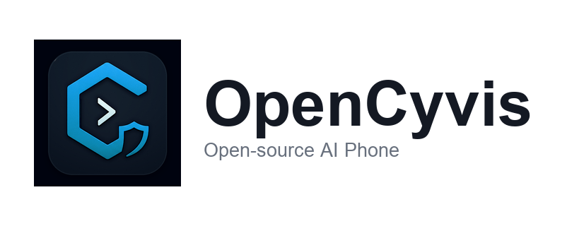
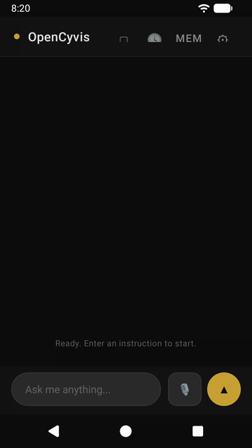
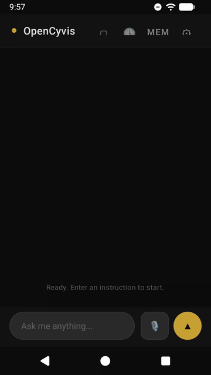
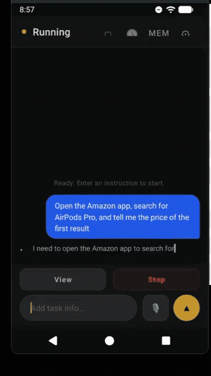
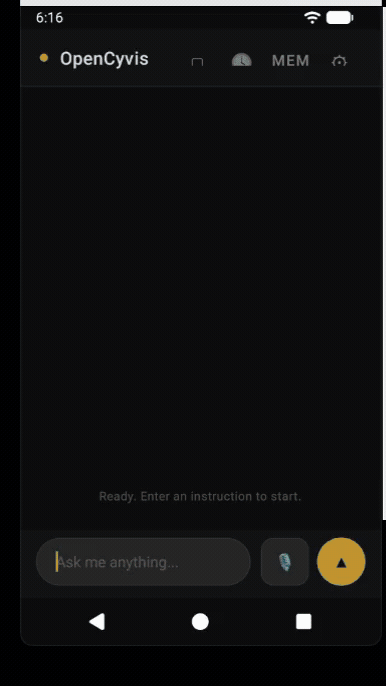

<picture>
  <source media="(prefers-color-scheme: dark)" srcset=".github/github-banner-dark.png">
  <source media="(prefers-color-scheme: light)" srcset=".github/github-banner-light.png">
  
</picture>

<p align="center">
  <strong>The open-source AI phone.</strong><br>
  Commercial AI phones are black boxes. This one isn't.<br><br>
  <sub><b>Open</b> <b>Cy</b>ber Jar<b>vis</b></sub>
</p>

<p align="center">
  <a href="README_CN.md">中文</a> •
  <a href="#getting-started">Getting Started</a> •
  <a href="#roadmap">Roadmap</a> •
  <a href="CONTRIBUTING.md">Contributing</a>
</p>

<p align="center">
  <a href="LICENSE"></a>
  <a href="#"></a>
  <a href="#"></a>
  <a href="#supported-models"></a>
  <a href="#"></a>
</p>

---

## Why

When a company ships an "AI phone," they get full access to your screen, your apps, your messages, your banking — and you can't see what model is running, can't verify what data leaves your device, can't choose an alternative.

Doubao AI Phone? Locked to ByteDance's model. Samsung Galaxy AI? Locked to Samsung + Google. Google's built-in AI? Gemini only. You get whatever they decide to give you.

**You should at least have the choice.**

OpenCyvis is the open-source alternative: you see every line of code, you pick the AI model, you decide where your data goes. With a local model, nothing ever leaves your device.

---

## What It Does

OpenCyvis turns any compatible Android device into an AI phone. Give it a task in natural language — it sees your screen, understands the UI, and operates apps just like you would.

**"Find the best-rated coffee shop nearby and get directions"** — opens Maps, searches, sorts by rating, taps the top result, starts navigation.

**"Look up flights to Tokyo next Friday — find the cheapest direct one"** — opens the travel app, enters dates, filters direct flights, sorts by price.

**"Set a 7am alarm, turn on Do Not Disturb, and switch to dark mode"** — chains Clock, Settings, and Display in one go.

<p align="center">
  
  &nbsp;&nbsp;
  
</p>
<p align="center">
  <sub>Left: three tasks in one go (alarm → DND → dark mode) &nbsp;|&nbsp; Right: cross-app price comparison on Amazon vs Walmart</sub>
</p>

### It works in the background

Most AI tools lock your screen while they work. OpenCyvis operates on a **virtual display** — an isolated background screen. The AI books your flight while you scroll Twitter.

```
┌─────────────────────┐    ┌─────────────────────┐
│   Your screen        │    │   Virtual display    │
│                      │    │   (AI works here)    │
│   Browse, chat,      │    │                      │
│   watch videos —     │    │   Booking flights,   │
│   phone is yours     │    │   sending messages,  │
│                      │    │   placing orders     │
└─────────────────────┘    └─────────────────────┘
      You use this              AI uses this
```

Watch the AI work anytime. Take over if something looks wrong. Hand it back when you're done. It picks up right where you left off.

<p align="center">
  
  &nbsp;&nbsp;
  
</p>
<p align="center">
  <sub>Left: watch the AI's virtual display in real time &nbsp;|&nbsp; Right: floating overlay on home screen while AI works</sub>
</p>

---

## How It Compares

| | Commercial AI Phones | Cloud Phones | ADB-based Agents | **OpenCyvis** |
|---|:---:|:---:|:---:|:---:|
| **Open source** | ❌ | ❌ | ⚠️ | ✅ |
| **Choose your AI model** | ❌ | ❌ | ⚠️ | ✅ |
| **Data stays on device** | ❌ | ❌ | ⚠️ | ✅ |
| **Phone usable while AI works** | ⚠️ | ✅ | ❌ | ✅ |
| **Works with any app** | ⚠️ | ⚠️ | ⚠️ | ✅ |
| **No ADB required** | ⚠️ | ⚠️ | ❌ | ✅ |

---

## Features

- **Background operation** — AI works on a virtual display; your phone stays free
- **Any AI model** — Qwen, Claude, GPT, Llama, Gemma, or run locally with Ollama
- **Natural language** — describe what you want in plain text or voice
- **Visual + structural understanding** — reads both screenshots and the UI element tree
- **Watch & takeover** — observe the AI in real-time, take control anytime, hand back seamlessly
- **Asks when unsure** — pauses on ambiguity ("Which Zhang Wei? I see three") instead of guessing
- **Safety guards** — repeated action detection, confirmation for sensitive operations
- **Offline voice** — on-device speech recognition (Sherpa-ONNX), no internet needed
- **100% open source** — audit every line

---

## Supported Models

OpenCyvis is model-agnostic. Bring your own API key, or run a local model and never make a network call.

| Provider | Examples | Notes |
|:---|:---|:---|
| **OpenAI-compatible** | Qwen, GPT | Default — works with any OpenAI-compatible API |
| **Anthropic** | Claude Sonnet | Native Anthropic API support |
| **Ollama (local)** | Gemma, Llama, Qwen | Runs on-device or on your own server — nothing leaves your control |

### Local Model Benchmarks

We tested 6 local models on 4 real-world UI scenarios (open settings, dial a number, handle impossible tasks, find a contact):

| Model | Size | Speed | Pass Rate |
|:---|:---:|:---:|:---:|
| **Gemma 4 26B-A4B** Q4 | 17 GB | 63 tok/s | **4/4** |
| **Gemma 4 E2B** Q4 | 1.8 GB | 41 tok/s | **4/4** |
| **Gemma 4 31B** Q4 | 19 GB | 16 tok/s | 4/4 |
| **Qwen 3.5 35B-A3B** Q4 | 22 GB | 47 tok/s | 3/4 |
| **Gemma 4 E4B** Q4 | 3 GB | 61 tok/s | 3/4 |
| **GUI-Owl 1.5 8B** Q4 | 5.4 GB | 75 tok/s | 2/4 |

> **Recommended:** Gemma 4 26B-A4B — best balance of speed, quality, and memory.  
> **Minimal:** Gemma 4 E2B — just 1.8 GB, still passes all 4 tests.

---

## Privacy & Security

An AI agent with full phone access is one of the most privileged pieces of software you can run. This is not a place for "trust us."

- **Screenshots and UI tree stay in memory** — never written to disk, never stored
- **You choose the endpoint** — self-hosted, private cloud, or fully local
- **No telemetry, no analytics, no phone-home** — zero tracking code
- **Open source** — security researchers, journalists, anyone can audit
- **Local model option** — use Ollama and nothing leaves the device. Period.

```
Your screen ──→ Screenshot (RAM only) ──→ Your chosen AI ──→ Action
                                           ↑
                              You control this endpoint
```

---

## Getting Started

### Requirements

- AOSP system image
- Platform key signing (system app privileges)

OpenCyvis is a privileged system application. It requires system-level access for screen capture and input injection — no root hacks or accessibility service workarounds.

### Build from source

```bash
git clone https://github.com/opencyvis/opencyvis-phone.git
cd opencyvis-phone/android
./gradlew assembleRelease
```

### Deploy to device

See [docs/aosp-deployment.md](docs/aosp-deployment.md) for deploying on AOSP-compatible devices — covers symlink setup, device makefile, and platform key signing.

### No device? Try the emulator

```bash
./scripts/deploy-emu.sh
```

### Configure

Set your LLM provider in-app, or via deeplink:

```bash
# Local Ollama (fully private, no API key)
adb shell am start -a android.intent.action.VIEW \
  -d "opencyvis://config?provider=ollama&base_url=http://localhost:11434&model=gemma4:26b"

# Cloud API
adb shell am start -a android.intent.action.VIEW \
  -d "opencyvis://config?provider=openai&base_url=https://api.openai.com/v1&api_key=YOUR_KEY&model=qwen-vl-max"
```

---

## Roadmap

### Next
- Lighter installation (no ROM flash required)
- Cross-device coordination (phone + desktop)

### Vision
- AI phones should be public infrastructure, not proprietary products. Our goal is to build an open standard for mobile AI agents — one that anyone can own, audit, and control.

---

## Contributing

See [CONTRIBUTING.md](CONTRIBUTING.md). We welcome code, bug reports, security audits, translations, and documentation.

## License

[Apache 2.0](LICENSE)

## Acknowledgments

- [Sherpa-ONNX](https://github.com/k2-fsa/sherpa-onnx) — on-device speech recognition (Apache 2.0)
